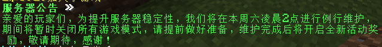
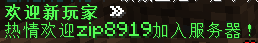

# EventsCountdown 事件倒计时插件

一个为Minecraft服务器设计的事件倒计时插件，会在玩家加入游戏时显示距离特定事件（如高考）的剩余时间。


*高考倒计时效果示例*

## 快速开始

1. 将插件JAR文件放入服务器的 `plugins` 文件夹
2. 重启服务器生成配置文件
3. 编辑 `plugins/EventsCountdown/config.yml` 进行个性化配置
4. 使用 `/ec reload` 重载配置或重启服务器

## 核心功能

- 🎯 **智能倒计时** - 自动计算距离高考的剩余时间
- 🎨 **高度可定制** - 支持自定义显示格式和颜色代码
- 🔌 **插件集成** - 完美支持PlaceholderAPI和LiteMotto
- 👤 **个人设置** - 允许玩家控制是否显示倒计时
- 🔄 **自动更新** - 定时刷新倒计时信息

## 功能展示

### 高考倒计时

*高考倒计时效果 - 显示距离高考的剩余时间*

### 元旦倒计时

*元旦倒计时效果 - 迎接新年的倒计时*

### 服务器公告

*服务器公告功能 - 显示重要服务器信息*

### 服务器状态

*服务器状态显示 - 实时监控服务器性能*

### 玩家加入欢迎

*玩家加入欢迎信息 - 新玩家加入时的欢迎语*

### 每日笑话

*每日笑话功能 - 为玩家带来欢乐*

### MC冷知识

*MC冷知识分享 - 有趣的游戏知识*

## 命令与权限

### 命令
- `/eventscountdown` 或 `/ec` - 主命令
  - `/ec on/off/toggle` - 控制倒计时显示
  - `/ec reload` - 重载配置（需要管理员权限）

### 权限
- `eventscountdown.use` - 基础命令权限（默认所有玩家）
- `eventscountdown.admin` - 管理员权限（默认仅OP）

## 配置说明

详细配置说明请查看生成的 `config.yml` 文件，其中包含了完整的占位符和PAPI变量说明。

### 配置示例

插件支持多种配置模式，以下是一些常用配置示例：

#### 高考倒计时配置
```yaml
exam-date-pattern: "06-07 09:00:00"
display-format: |-
  &b&l{year}年高考倒计时: &f&l{days}天 {hours}小时 {minutes}分钟 {seconds}秒
  &a&o{litemotto}
litemotto-prompt: "请生成一句积极向上的高考励志语句，鼓舞人心。不要包含任何前后缀、额外的文字或解释。"
```

#### 元旦倒计时配置
```yaml
exam-date-pattern: "01-01 00:00:00"
display-format: |-
  &b&l{year}年元旦倒计时: &f&l{days}天 {hours}小时 {minutes}分钟 {seconds}秒
  &a&o{litemotto}
litemotto-prompt: "请生成一句迎接新年的积极祝福语句，温馨美好。不要包含任何前后缀、额外的文字或解释。"
```

#### 服务器公告配置
```yaml
display-format: |-
  &a&l服务器公告 &f&l»
  &a亲爱的玩家们，为提升服务器稳定性，我们将在本周六凌晨2点进行例行维护，
  &a期间将暂时关闭所有游戏模式，请提前做好准备，维护完成后将开启全新活动奖励，敬请期待，感谢！
```

#### 服务器状态配置
```yaml
display-format: |-
  &a&l服务器状态 &f&l»
  &a延迟: &f%player_ping%ms &a在线: &f%server_online%/%server_max_players%
  &aTPS: &f%server_tps%
```

#### 玩家加入欢迎配置
```yaml
display-format: |-
  &a&l欢迎新玩家 &f&l»
  &a{litemotto}
litemotto-prompt: "请生成一句热情的玩家欢迎语，友好真挚。欢迎%player_name%加入服务器，不要包含任何前后缀、额外的文字或解释。"
```

#### 每日笑话配置
```yaml
display-format: |-
  &d&l今日笑话 &f&l»
  &b&o{litemotto}
litemotto-prompt: "请生成一句有趣的笑话或幽默段子。不要包含任何前后缀、额外的文字或解释。"
```

#### MC冷知识配置
```yaml
display-format: |-
  &d&l你知道吗？ &f&l»
  &b&o{litemotto}
litemotto-prompt: "请生成一条关于《我的世界》游戏的冷知识或实用小技巧。不要包含任何前后缀、额外的文字或解释。"
```

## PlaceholderAPI支持

插件提供丰富的PAPI变量，具体变量列表和用法请参考配置文件中的详细注释。

### 主要占位符变量

插件提供以下主要占位符变量，可在配置文件中使用：

- `%eventscountdown_days%` - 剩余天数
- `%eventscountdown_hours%` - 剩余小时数  
- `%eventscountdown_minutes%` - 剩余分钟数
- `%eventscountdown_seconds%` - 剩余秒数
- `%eventscountdown_year%` - 事件年份
- `%eventscountdown_exam_date%` - 完整事件日期 (yyyy-MM-dd HH:mm:ss)
- `%eventscountdown_exam_date_short%` - 简短事件日期 (yyyy-MM-dd)
- `%eventscountdown_exam_date_chinese%` - 中文完整事件日期 (yyyy年MM月dd日 HH:mm:ss)
- `%eventscountdown_exam_date_chinese_short%` - 中文简短事件日期 (yyyy年MM月dd日)
- `%eventscountdown_litemotto%` - 当前格言内容
- `%eventscountdown_litemotto_enabled%` - LiteMotto插件是否可用 (true/false)
- `%eventscountdown_formatted%` - 格式化的倒计时

### 使用示例

在配置文件中使用占位符：
```yaml
display-format: |-
  &b&l事件倒计时: &f&l%eventscountdown_days%天 %eventscountdown_hours%小时
  &a&o%eventscountdown_litemotto%
```

## 高级功能

### 多事件支持
插件支持配置多个不同的事件倒计时，只需在配置文件中设置不同的日期模式即可。

### 自定义显示格式
支持使用Minecraft颜色代码和格式代码来自定义显示效果：
- `&0` - 黑色
- `&1` - 深蓝色
- `&2` - 深绿色
- `&3` - 湖蓝色
- `&4` - 深红色
- `&5` - 紫色
- `&6` - 金色
- `&7` - 灰色
- `&8` - 深灰色
- `&9` - 蓝色
- `&a` - 绿色
- `&b` - 天蓝色
- `&c` - 红色
- `&d` - 粉红色
- `&e` - 黄色
- `&f` - 白色
- `&k` - 随机字符
- `&l` - 粗体
- `&m` - 删除线
- `&n` - 下划线
- `&o` - 斜体
- `&r` - 重置格式

### LiteMotto集成
插件深度集成LiteMotto插件，可以自动生成与事件相关的励志语句、祝福语等内容。

## 构建与开发

```bash
# 构建插件
mvn clean package
```

## 许可证

MIT License - 详见 [LICENSE](LICENSE) 文件